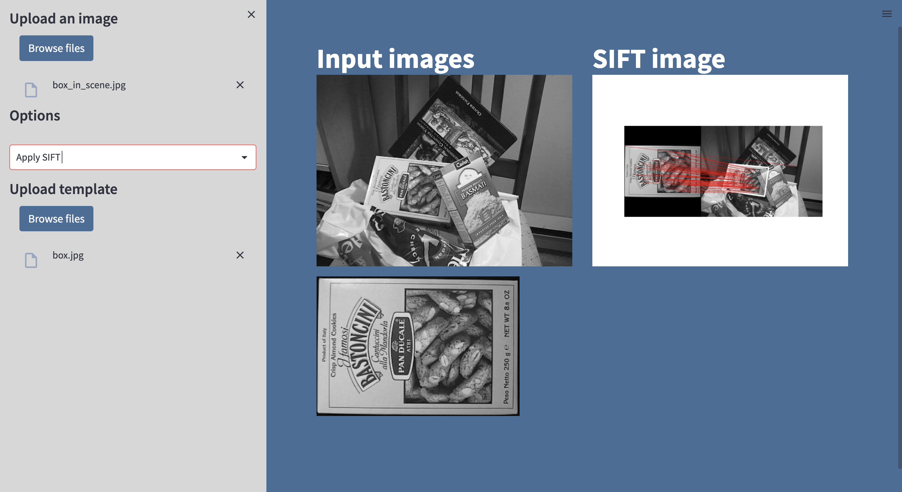

# Image Matching

A web application that use python script for image processing such as Extract the unique features in all images using Harris operator and λ-, Generate feature descriptors using scale invariant features(SIFT) and Match the image set features using sum of squared differences (SSD) and normalized cross correlations (NCC).

> ## Table of Contents

- [Built with](#Built-with)
- [Deployment](#Deployment)
- [Features](#Features)
- [Authors](#Authors)


> ## Built with


> ## Deployment

 Install streamlit

```bash
  pip install streamlit
```

To start deployment 
```bash
  streamlit run app.py
```


> ## Features
###  Extract the unique feature using Harris operator


#### Image matching
1. Using sum of squared differences (SSD).


2. Using normalized cross correlations (NCC).


###  Generate feature descriptors using scale invariant features(SIFT)


> ## 🔗 Authors
- Esraa Ali         
sec : 1   BN : 12

- Rawan Abdulhamid  
sec : 1   BN : 33

- Mostafa Mahmoud   
sec : 2   BN : 37

- Omar Mustafa      
sec : 2   BN : 5  

- Yehia Said        
sec : 2   BN : 53 


All rights reserved © 2023 to Team 9 - Systems & Biomedical Engineering, Cairo University (Class 2024)